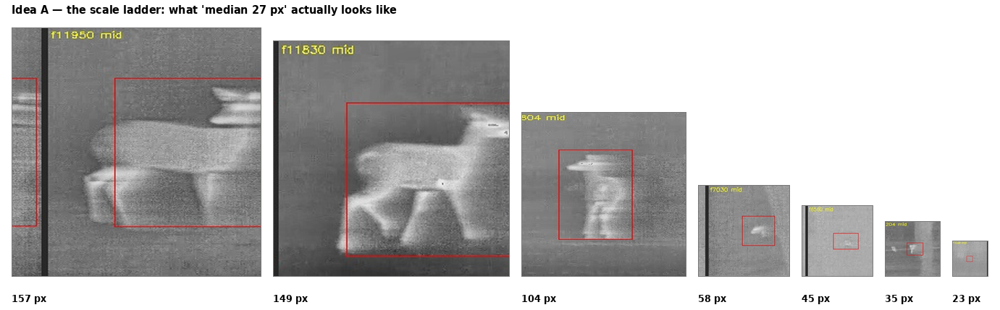
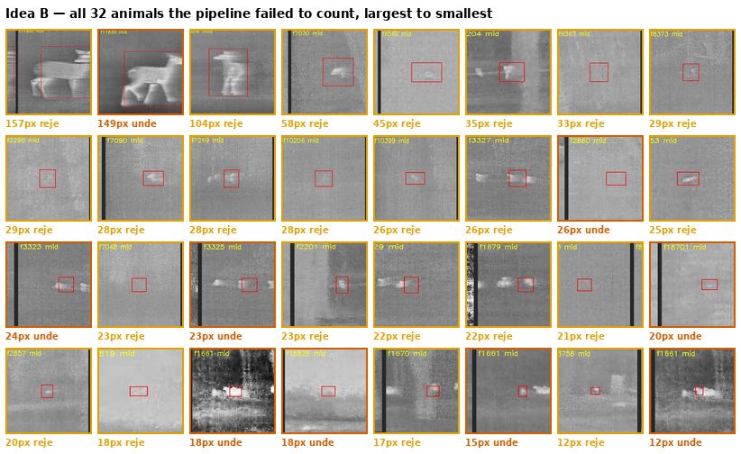
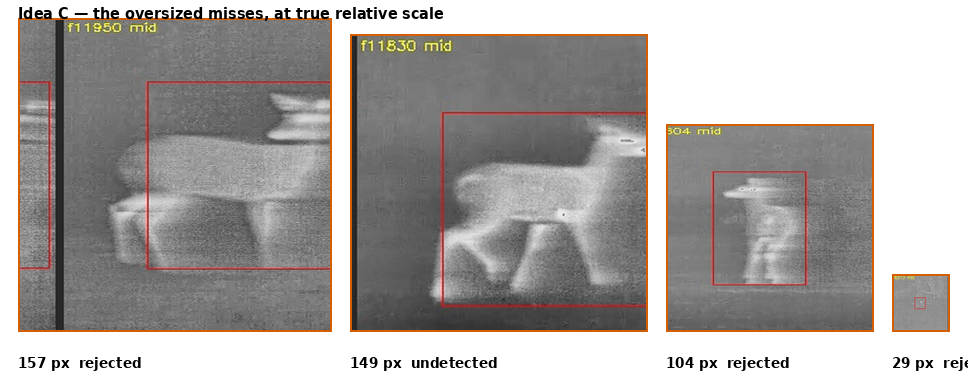

# Six qualitative figure ideas — deer imagery

The current qualitative figure is a 2×2 of frames with coloured boxes. It shows the tracker
working, which is worth showing once, but it is the same picture every detection paper has.

The three below marked **draft ready** were built in seconds from frames already rendered in
`wildlife_outputs/viz/` — no video decoding, no GPU. Run `make_qual_previews.py` to rebuild.
The last three need a job because they need frames we have not extracted yet.

---

## A. The scale ladder — *draft ready*

One animal per size step, from 157 px down to 12 px, **all drawn at true relative scale on a
common baseline**. The paper says "median 29×24 px" and "71% below the COCO small threshold"
half a dozen times. Nobody outside thermal imaging knows what that means. This makes the
whole difficulty of the task legible in one glance, and it costs a third of a column.

**Best placed** in Section 3.2, where object scale is introduced.

---

## B. The failure gallery — *draft ready*

**All 32 animals the pipeline failed to count**, largest to smallest, each with its
ground-truth box, labelled with size and whether it was never detected or detected and then
rejected. Table 13 gives this as three rows of summary statistics.

The draft already argues two things the prose has to assert. The three at top-left are
unmistakable animals that were missed — nothing about them is hard. And from roughly 28 px
down, every panel is a faint smudge a human would hesitate over, which is the honest picture
of where the remaining 26 animals live. A reader who sees this stops suspecting the
annotations and starts believing the sensor limit.

**Best placed** in Section 4.8. **Replaces nothing** — Table 13 stays, this is the evidence
for it.

---

## C. The oversized misses — *draft ready*

The 157, 149 and 104 px animals beside a median 27 px one, at true relative scale. The 149 px
animal was **never detected in any frame**. Section 4.8 explains this as a training
distribution that contains no box above 95.6 px, which is a plausible-sounding claim until
you see the animal it failed on.

This is the single most persuasive image available from the current data, and it is nearly
free. Its weakness is that it overlaps B — B contains these three as its first tiles.
**Pick one of B or C, not both.**

---

## D. Tracking through overlap — a filmstrip, not a 2×2

Six consecutive frames of the same two animals crossing, boxes coloured by track ID, with
the calibrated score under each frame. The current Figure 8 shows two moments 0.3 s apart and
asks the reader to trust that identity was maintained between them. A strip shows continuity
rather than asserting it, and the moment of maximum overlap becomes visible instead of
inferred.

**Needs** a frame-extraction job over the chosen video (CPU, ~20 min). **Replaces** Figure 8.

---

## E. Trajectory trails — one image per transect

A single frame per video with every confirmed animal's full path drawn as a fading ribbon of
its own boxes, so a whole transect's counting result is one picture. It also shows the
ego-motion the tracker corrects for: trails curve because the camera is moving, and the fact
that identity survives that curve is the argument for the motion-compensation term.

The most visually striking of the six, and the only one that shows a *whole video* rather
than a moment.

**Needs** a job (CPU decode plus compositing, ~40 min). **Adds to** Section 4.5.

---

## F. Contrast normalization, with detections

The same hard frame twice — raw sensor output and after CLAHE — with the detector's boxes
drawn on both. Section 3.1 reports that this preprocessing is worth more than any
architectural choice tested (test mAP50 0.519 against 0.299, a larger effect than the entire
0.365–0.510 spread across eleven architectures), and shows the reader nothing.

Figure 2 currently shows raw against ground truth, which demonstrates that annotation is
possible, not that detection is. Running the detector on both halves is the version that
supports the claim.

**Needs** a GPU job (~15 min). **Extends** Figure 2.

---

## Recommendation

**B and A.** Together they cost about one column, need no new compute, and cover the two
things the paper repeatedly asserts and never shows: what the object scale really is, and
what the failures really look like. B is the stronger of the two — it is the figure a
reviewer will remember.

**Then F**, because it is a small job and it evidences the largest single effect in the
paper.

D and E are better *pictures* but they illustrate what already works. B, A and F illustrate
what is hard, which is what this paper is actually about.
