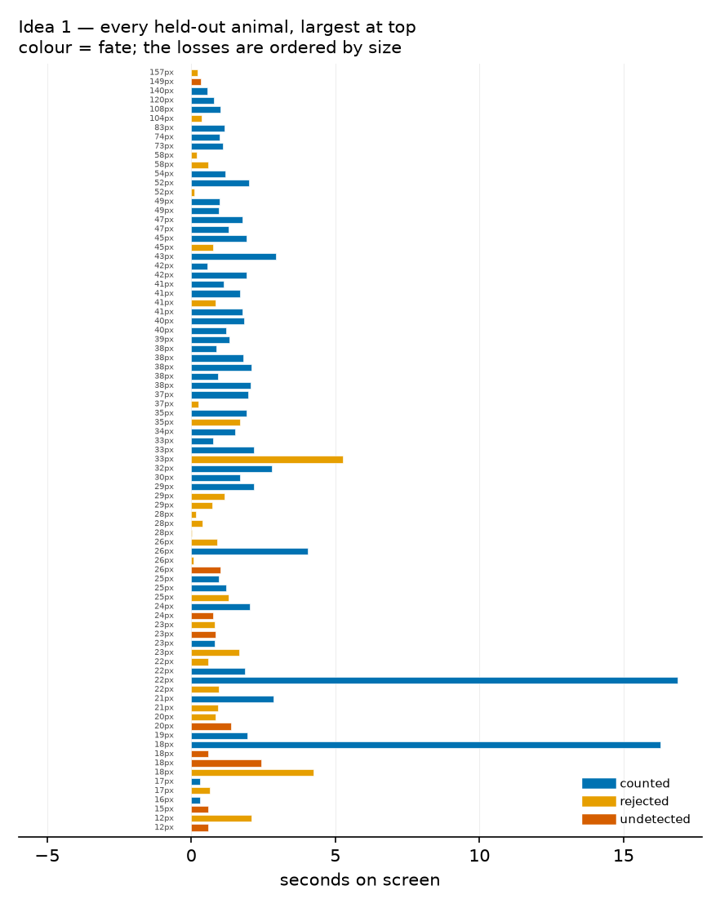
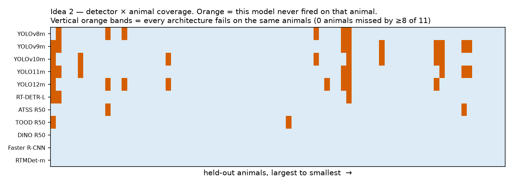
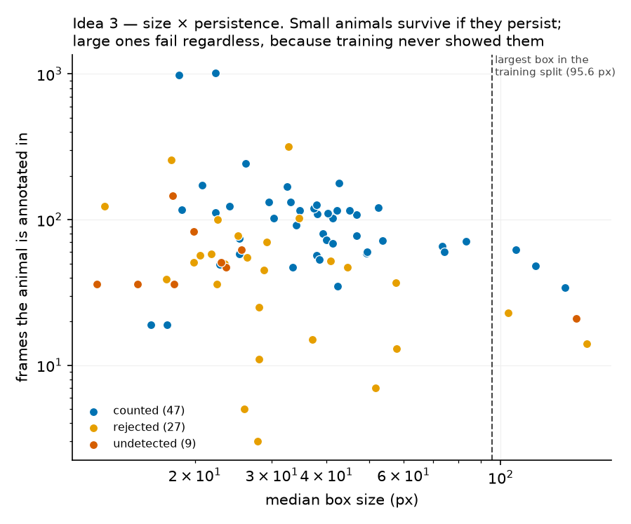
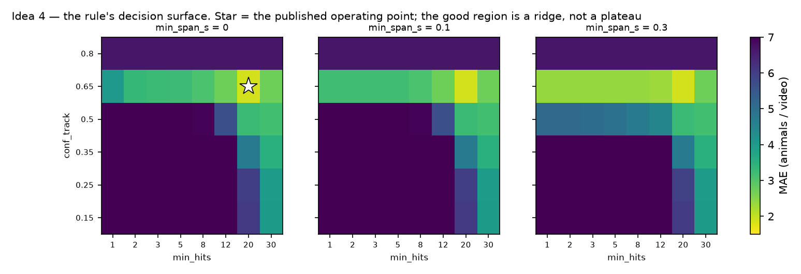
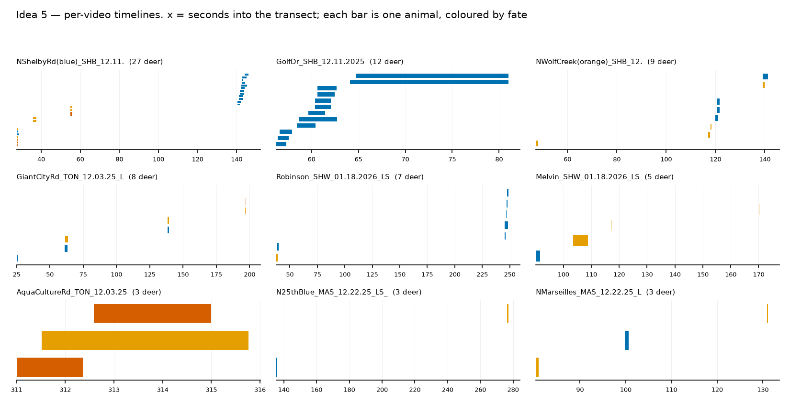
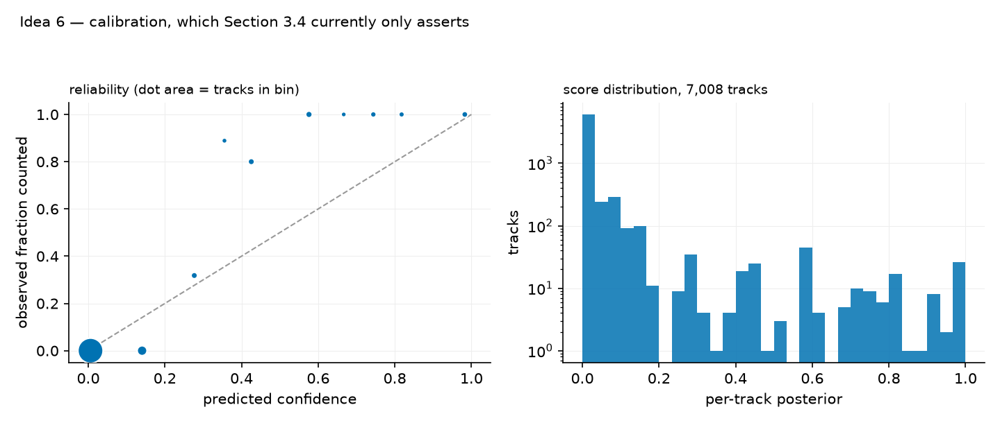

# Six candidate figures

Written after cutting the rank bump chart. The brief was that the paper's visuals are
"cheap and normal" — bar charts, a funnel, a histogram, and frames with boxes drawn on
them. Fair. None of them show anything the tables don't already say.

The ones below are chosen against one test: **could a table say this instead?** If yes, it
is not worth a figure. Each of these shows structure that is invisible in aggregate — which
animal, which model, which video, which threshold — and every one is built from data
already on disk. No new GPU jobs.

Effort is my time, not yours. "Half a day" means I write the script, render it, and check
it reads correctly at print size.

**Every image below is a real draft from real data**, produced by `make_previews.py` in this
folder — not a mockup. They are deliberately unpolished: no caption fitting, no print-size
tuning, no colour-blind check. That work happens once one is chosen. Rendering them changed
my recommendation, which is the point of rendering them.

```
python docs/figure_ideas/make_previews.py
```

---

## 1. Per-animal fate chart — every held-out animal as one row




**What.** 83 rows, one per held-out animal, sorted by median box size. Each row is a
horizontal strip spanning that animal's time on screen, coloured by fate: counted,
detected-but-rejected, never-detected. Three marks per row — first detection, best
detection, confirmation decision.

**Why it beats what's there.** Figure 1 gives 98.8 → 88.0 → 62.7 as three bars. It cannot
show that the losses are *ordered by size*, that rejected animals cluster at short track
lengths, or that the three oversized animals fail for a different reason than the 20 px
ones. A reader currently has to take "the rejected group sits between the other two on every
measure" on trust from Table 13. Here they would see it.

**Data.** `results/track_recall/roster_conf0.25/yolo11m_640/track_recall.csv` (per-track
`gt_frames`, `best_conf`, `found_touch`, `split`) + `per_track_confidence.csv` for the
confirmation decision. Both present.

**Effort.** Half a day. **Could replace** Figure 1 or sit beside it.

---

## 2. Detector × animal coverage matrix — does everyone miss the *same* deer?




**What.** An 11 × 83 grid. Rows are the detectors of Table 3, columns are held-out animals
sorted by size, cell filled if that detector found that animal in at least one frame.

**Why it beats what's there.** This tests the paper's central claim about the regime. If the
dark cells form **vertical stripes** — every architecture missing the same animals — the
corpus is the limit and "data-limited, not architecture-limited" is proven rather than
inferred from a narrow AP spread. If they scatter, the claim is wrong and we need to know
before a reviewer checks. Right now the paper argues this from eleven aggregate numbers
lying close together, which is weaker evidence and a reviewer may say so.

**Data.** Already computed — the 11 `track_recall.csv` files from the roster sweep, plus
the mmdet five. Nothing to run.

**Effort.** Half a day, and it is the one I would build first. It is a genuinely new result,
not a redrawing. **Adds to** Section 4.1; nothing to replace.

**It did contradict the paper, and the draft above shows it.** There are no universal
vertical bands: **zero animals are missed by eight or more of the eleven models**. DINO R50,
Faster R-CNN and RTMDet-m miss almost nothing at all, while the YOLO family drops scattered
individuals. So the misses are largely *model-specific*, not a property of the corpus, and
this figure does **not** support "every architecture fails on the same animals".

What it does support is sharper, and still the paper's argument. The models that miss nothing
are the recall-heavy ones that buy their coverage with thousands of false positives — RTMDet-m
finds 99.6% of animals and emits 4513 false boxes at this same threshold. So *which* animals
you lose is set by where you sit on the precision/recall curve, not by architecture. That is
the operating-point argument of Section 4.2, shown per-animal instead of asserted.

Using it means rewriting the claim it illustrates. Worth doing, but it is an edit to the
argument, not a drop-in figure.

---

## 3. Size × persistence scatter, with the training distribution behind it




**What.** One point per held-out animal: median box size on x, track length on y, coloured
by fate. Behind it, the training split's size distribution as a shaded band, so the 95.6 px
ceiling is a visible wall with three counted-as-missed animals stranded to the right of it.

**Why it beats what's there.** Figure 9 is a histogram with three annotated dots. It shows
the hole but not that failure is a *joint* function of size and persistence — small animals
survive if they persist, large ones fail regardless. That is a different and more useful
statement than "the detector fails at both extremes".

**Data.** `track_recall.csv` (`gt_frames`) + CVAT box sizes. Present.

**Effort.** Half a day. **Replaces** Figure 9.

---

## 4. The rule's decision surface




**What.** A heatmap of held-out MAE over the confirmation rule's grid — `min_hits` × 
`conf_track`, faceted by `min_span_s` — with the published operating point marked and the
zero-bias contour drawn on top.

**Why it beats what's there.** Tables 10 and 11 give two slices through a 288-cell grid.
The surface shows the whole thing: that the good region is a narrow ridge rather than a
plateau, that `min_span_s` is inert across three of its values, and that minimum-MAE and
zero-bias are different points. It answers "was 0.65 tuned or lucky?" in one look, which is
the first question a reviewer asks about a hand-tuned rule.

**Data.** `count_eval_sweep.csv` (288 cells) and `conf_sensitivity.csv`. Present.

**Effort.** Half a day. **Could replace** Table 10 or 11, so it costs no page count.

---

## 5. Per-video count timelines — where the miscount happens




**What.** 13 small panels, one per held-out video. In each, ground-truth animals are
horizontal bars on a time axis; confirmed tracks are drawn beneath them. Over-counts show as
two tracks under one animal, misses as a bar with nothing under it, merges as one track
under two bars.

**Why it beats what's there.** Table 7 gives a per-video error column. It says NShelbyRd
loses 5 to detection and 6 to association but not *when* — whether the failures cluster where
animals are dense, or are spread through the transect. This is also the figure that makes
the work legible to a wildlife biologist rather than a vision reviewer.

**Data.** `tracks.csv` (per-frame, `confirmed` flag) + CVAT ground truth. Present.

**Effort.** One day — the layout needs care at 13 panels. **Adds to** Section 4.3.

---

## 6. Calibration and count uncertainty




**What.** Two panels. Left: a reliability diagram of the per-track posterior — predicted
confidence against observed correctness, with the diagonal. Right: per video, the predicted
count with its Poisson-binomial interval against the true count.

**Why it beats what's there.** Section 3.4 claims 92.1% of counted animals carry confidence
≥ 0.80, mean 0.965, AUC 0.893, and that the system emits an uncertainty interval rather than
a point estimate. All of that is asserted in prose with no picture. For a survey tool the
auditability claim is a selling point, and a reliability diagram is how that claim is
normally evidenced. The right panel also shows whether the intervals actually cover truth,
which the paper currently never demonstrates.

**Data.** `per_track_confidence.csv` (`confidence`, `counted`) + `count_gt.csv`. Present.

**Effort.** Half a day. **Adds to** Section 3.4.

---

## If you want a shortlist

Revised after seeing the drafts.

**Build 4 first.** It came out best of the six and needs no argument changed. The bright band
at `conf_track = 0.65` is the answer to "was that threshold tuned or lucky", the three panels
being near-identical is `min_span_s` being inert made visible, and it retires Table 10 or 11
so it costs nothing in pages.

**Then 3.** The cleanest of the remaining drafts, it replaces the weakest current figure, and
the joint size/persistence story is one the paper states in prose but never shows.

**Idea 2 is the most interesting and the most expensive.** It is a real finding, but it
argues against the sentence it was meant to support, so adopting it means rewriting part of
Section 4.1. Do it if you want the paper's strongest claim properly evidenced; skip it if the
goal is to finish.

**1 and 5 are honest but ordinary** in draft — 1 is a long ranked bar chart, and 5 reads as
nine sparse strips because most held-out videos hold only two or three animals. Neither is
worth a page as rendered.

**6 is worth doing if the calibration claim matters to you.** The reliability panel is thin
because most tracks sit at the extremes, but Section 3.4 currently asserts calibration with
no evidence at all.
